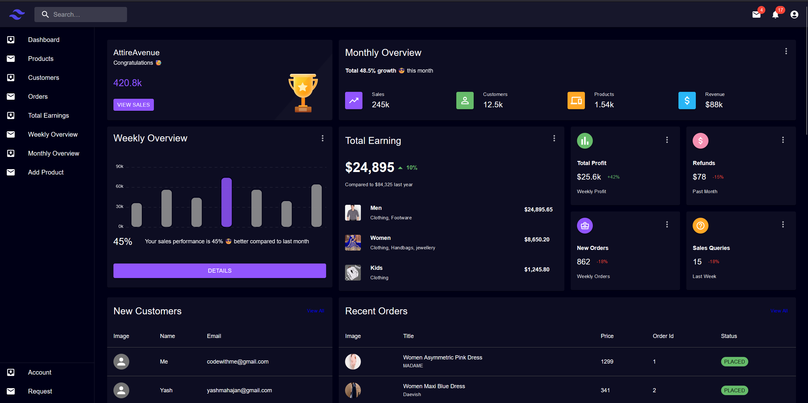

# AttireAvenue Frontend

Welcome to the AttireAvenue frontend repository. AttireAvenue is a full-stack e-commerce platform that offers a comprehensive solution for managing products, customers, orders, and earnings.


 **Front End**
 


 **Admin Panel**
 


## Table of Contents

- [Overview](#overview)
- [Features](#features)
- [Technologies](#technologies)
- [Getting Started](#getting-started)
- [Installation](#installation)
- [Usage](#usage)
- [Contributing](#contributing)
- [License](#license)

## Overview

AttireAvenue is a scalable e-commerce platform developed to provide a seamless shopping experience for users and a powerful management system for administrators. The frontend is built using modern web technologies, ensuring a fast, responsive, and user-friendly interface.

## Features

- **Dashboard**: Comprehensive overview of sales, earnings, and customer insights.
- **Product Management**: Easily add, edit, and manage products.
- **Order Management**: Track and update order statuses.
- **Customer Management**: View and manage customer information.
- **Analytics**: Weekly and monthly performance overviews with detailed earnings and profit insights.
- **Responsive Design**: Optimized for various devices and screen sizes.

## Technologies

- **Frontend Framework**: React.js
- **Styling**: Tailwind CSS
- **State Management**: Redux
- **Routing**: React Router
- **Charts**: Chart.js for data visualization

## Getting Started

Follow these instructions to get a copy of the project up and running on your local machine for development and testing purposes.

### Prerequisites

- Node.js (version 14 or above)
- npm or yarn

### Installation

1. **Clone the repository:**

   ```bash
   git clone https://github.com/yashmahaja/attireavenue-frontend.git
   cd attireavenue-frontend
   npm install
   npm start
